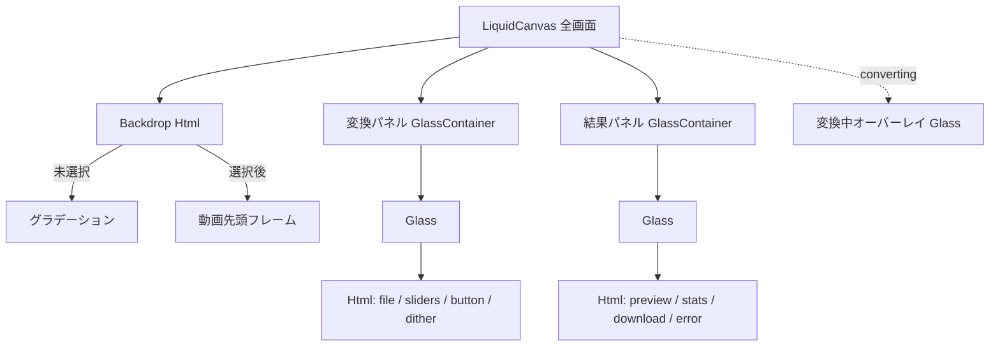
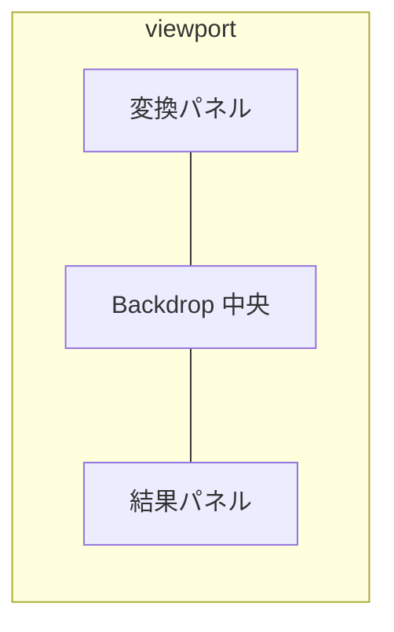
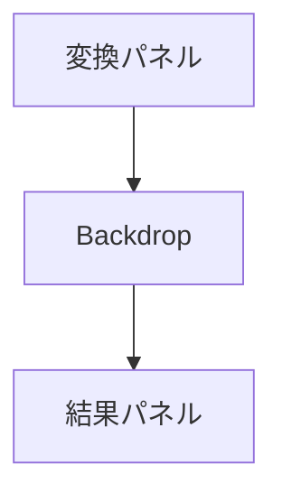
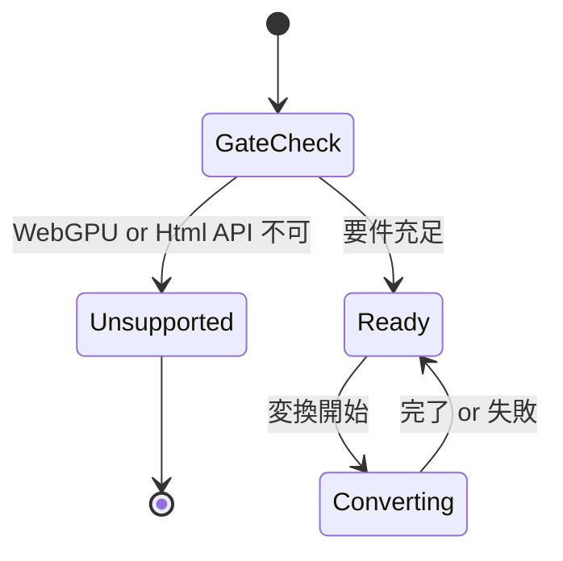
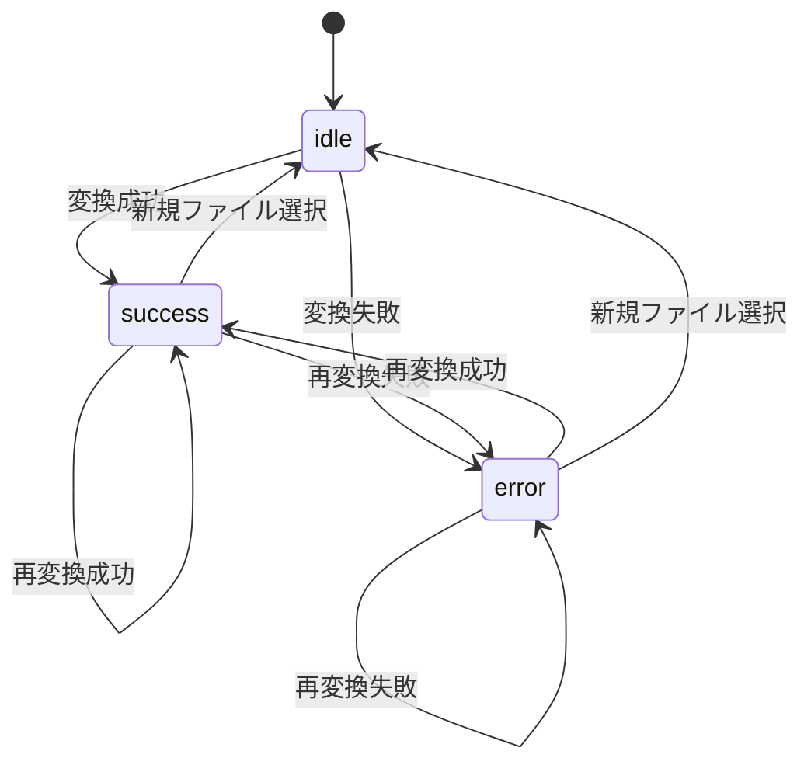

# Liquid UI 刷新 Design Doc

## 目的

movie_to_gif の UI を [Liquid DOM](https://53able.github.io/docs-site/docs/liquid-dom.html)（WebGPU リキッドグラス）で刷新する。変換ロジック（FFmpeg.wasm）は維持し、フレームワークを Vue 3 から React 19 へ移行する。

## 非目標（v1）

- ドラッグ＆ドロップによるファイル選択
- WebGPU 非対応ブラウザ向けフォールバック UI
- Three.js / R3F 統合

## 実行要件

| 要件 | 詳細 |
|------|------|
| WebGPU | `navigator.gpu` 必須。非対応時は説明画面のみ |
| HTML-in-Canvas | `Html` ノード利用のため Chrome + `chrome://flags/#canvas-draw-element` ON |
| React | React 19（`@liquid-dom/react` peer 想定） |

## シーングラフ



### z-order（手前 → 奥）

1. 変換中オーバーレイ（`converting` 時のみ）
2. 変換パネル（左 or 上）
3. 結果パネル（右 or 下）
4. Backdrop

## レイアウト

### Desktop（≥ 1024px）



### Narrow（< 1024px）



## 状態遷移

### アプリ全体



### 結果パネル



- **idle**: プレースホルダ文言
- **success**: GIF プレビュー + 容量比 + ダウンロードボタン
- **error**: プレビュー領域をエラーメッセージに差し替え（前回 GIF は破棄）

## グラススタイル（シネマティックダーク）

| パラメータ | 目安 | 備考 |
|------------|------|------|
| `blur` | 16–24 | Container / GlassContainer |
| `thickness` | 80–100 | リキッド感 |
| `tint` | 暗め半透明 | Backdrop の動画を活かす |
| `cornerRadius` | 40–48 | squircle |
| `cornerSmoothing` | 高め | iOS 風 |
| テキスト | 白系 | `Html` 内 CSS |

変換中オーバーレイは同系統の半透明 Glass。中央に `<progress>` + ％。

## コード構成

```
src/
├── main.tsx
├── app/
│   ├── App.tsx                 # LiquidGate 分岐
│   └── UnsupportedScreen.tsx   # 要件説明
├── features/converter/
│   ├── hooks/
│   │   ├── useLiquidGate.ts    # WebGPU + Html API 判定
│   │   ├── useVideoBackdrop.ts # 先頭フレーム抽出
│   │   └── useFfmpegConvert.ts # 変換・progress・error
│   ├── ui/
│   │   ├── ConverterScene.tsx  # LiquidCanvas ルート
│   │   ├── ConvertPanel.tsx
│   │   ├── ResultPanel.tsx
│   │   └── ConvertingOverlay.tsx
│   └── types.ts
└── lib/
    └── formatFileSize.ts
```

## 依存関係（追加予定）

```bash
pnpm add @liquid-dom/react react react-dom @ffmpeg/ffmpeg @ffmpeg/core
pnpm add -D @types/react @types/react-dom @vitejs/plugin-react
```

Vue 関連（`vue`, `@vitejs/plugin-vue`, `vue-tsc`）は削除。

## v1 機能一覧

| 機能 | 備考 |
|------|------|
| MP4/MOV ファイル選択 | `Html` 内 `<input type="file">` |
| FPS / スケール / ディザ | 現行と同範囲 |
| 変換実行 | FFmpeg.wasm |
| 進捗 | 全画面オーバーレイ |
| 容量比表示 | 成功時 |
| GIF プレビュー | 成功時 |
| GIF ダウンロード | `<a download>` |
| エラー表示 | 結果パネル error 状態 |

## 移行方針

Vue SFC を一括削除し React 19 + Liquid DOM に置換（1 PR）。中間的な Vue/React 同居は行わない。

## 参考

- [Liquid DOM ドキュメント](https://53able.github.io/docs-site/docs/liquid-dom.html)
- ADR: `docs/adr/0001-vue-react-liquid.md`
- ADR: `docs/adr/0002-webgpu-required.md`
